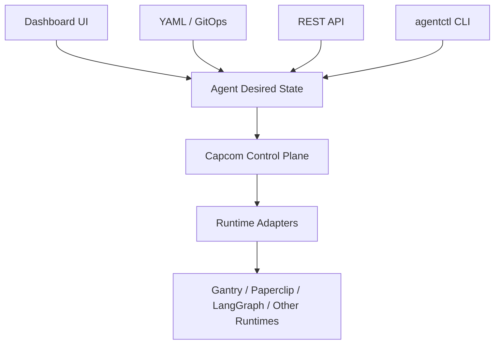
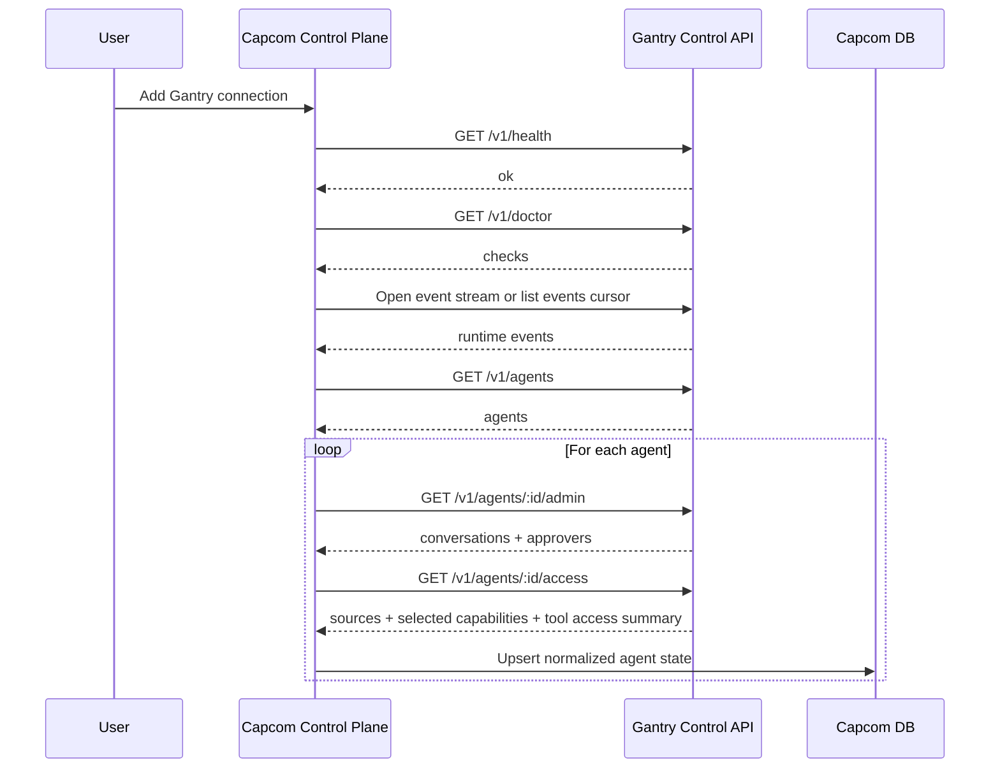
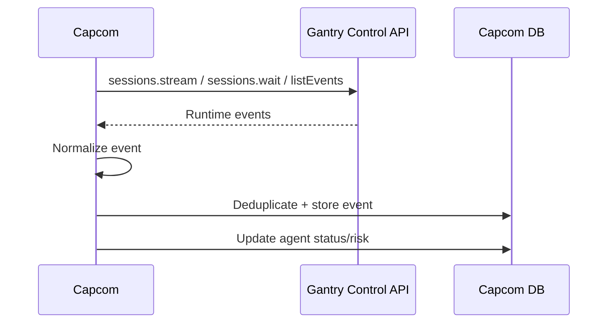
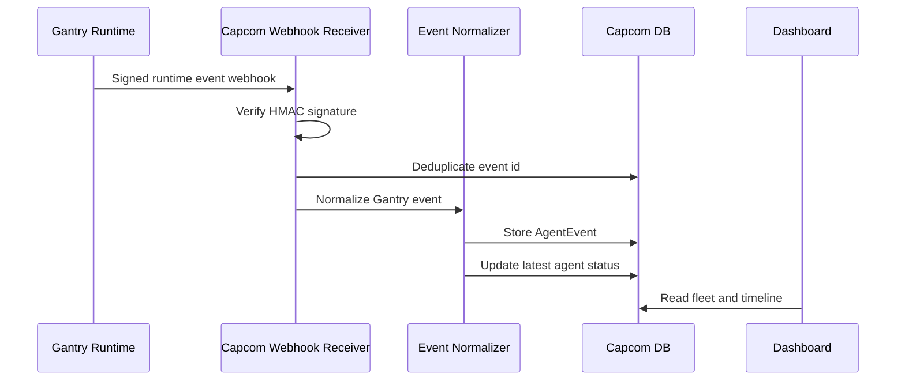
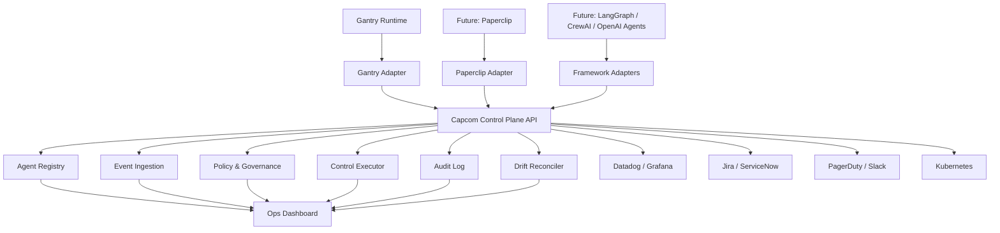
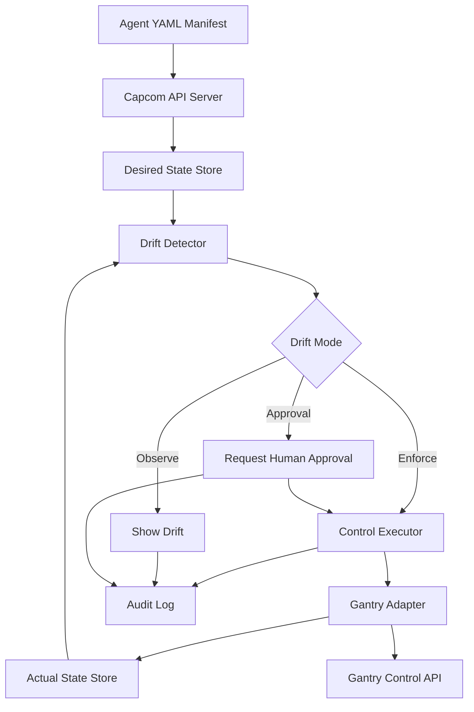

# Capcom MVP

## 1. Executive Summary

The MVP should be a standalone application named **Capcom** for governing production AI agents across runtimes, starting with **Gantry** as the first integration.

The product should not be another agent runtime, observability dashboard, or Kubernetes clone. It should provide a declarative, enterprise-ready control layer for agents:

- Which agents exist
- Who owns them
- What they can access
- What they are doing
- Whether they are compliant with desired policy
- What action operators can take when something goes wrong

The strategic direction is:

> Kubernetes controls compute. Capcom controls autonomous work.

The MVP should prove that an external control plane can connect to an existing agent runtime like Gantry, import agents, ingest events, detect drift, and perform soft control actions without forking or modifying the runtime.

## 2. MVP Thesis

Enterprises will not run all agents in one framework. They will use Gantry, LangGraph, CrewAI, Paperclip, OpenAI Agents, custom services, Kubernetes jobs, SaaS agents, and internal automation.

So the MVP should be **runtime-agnostic from day one**, even if it supports only Gantry initially.

The product wedge:

> Capcom is a declarative AgentOps control plane that lets enterprises define, observe, govern, and reconcile agent behavior across runtimes.

## 3. MVP Scope

### In Scope

| Module | MVP Capability |
|---|---|
| Agent Registry | Store agent name, owner, purpose, runtime, environment, risk level, status, tools, and data/system access |
| Runtime Connections | Connect to Gantry using Control API credentials |
| Gantry Adapter | Discover agents, capabilities, conversations, approvers, jobs, runs, and events |
| Declarative Manifests | Define desired agent state using YAML |
| Drift Detection | Compare desired YAML state with actual Gantry state |
| Event Ingestion | Receive Gantry runtime events through SDK streaming or polling, with webhook push deferred to Phase 2 |
| Lightweight Monitoring | Show agent status, recent activity, failures, denied tools, and runtime health |
| Governance | Track owners, approvers, risk level, capability grants, and approval requirements |
| Control Actions | Disable/enable agent, restrict capabilities, pause/resume jobs, mark review required |
| Audit Log | Record imports, syncs, drift detections, control actions, and policy changes |
| Integrations | Store links/placeholders for Datadog, Grafana, PagerDuty, Jira, ServiceNow, Kubernetes |

### Out of Scope for MVP

- Building our own agent runtime
- Replacing Datadog, Grafana, LangSmith, or Langfuse
- Full multi-agent orchestration
- Autonomous remediation by default
- Full Kubernetes CRD/operator support
- Token-level cost attribution
- Business ROI automation
- Full compliance suite
- Adapter marketplace
- True rollback unless the connected runtime exposes version restore semantics

### 3.1 MVP Feature List

| Priority | Feature | Description | Acceptance Signal |
|---|---|---|---|
| P0 | Runtime connection | Add a Gantry runtime using endpoint and scoped API key | Connection validates with health and doctor checks |
| P0 | Agent import | Import Gantry agents into Capcom registry | Agents show name, runtime id, status, owners, and timestamps |
| P0 | Capability import | Import tools, skills, MCP servers, conversations, and approvers | Agent detail shows actual runtime access |
| P0 | Desired state model | Create/edit desired state through API, CLI, dashboard, or YAML | One source of truth is visible across all surfaces |
| P0 | Drift detection | Compare desired state with Gantry actual state | Capability drift is detected and assigned severity |
| P0 | Control actions | Disable/enable agents and restrict capabilities | Runtime action succeeds and is reflected after sync |
| P0 | Audit log | Record every mutating action and sync result | Actor, reason, target, before/after, and result are visible |
| P0 | Event ingestion | Receive Gantry events through SDK/control API streaming or polling | Agent timeline shows recent runtime activity |
| P1 | Lightweight metrics | Store success rate, failures, p95 latency, estimated cost, drift count | Agent detail shows latest metric snapshot |
| P1 | Business value metadata | Capture value hypothesis, primary KPI, value owner, review cadence | Registry can filter/report agents by value owner and KPI |
| P1 | Topology metadata | Capture dependencies, called systems, and handoff targets | Agent detail shows manual topology relationships |
| P1 | Read-only mode | Connect runtime without write scopes | Capcom can observe without enabling control actions |

### 3.2 Target Users

| User | Primary Need | MVP Support |
|---|---|---|
| Platform engineer | Standardize how agents are registered, governed, and controlled | YAML, CLI, API, runtime connections, drift detection |
| AI engineer | See runtime status, capabilities, and failure context | Agent detail, timeline, capability view |
| Operator / support owner | Know what agents are running and take safe action | Dashboard, control actions, audit log |
| Security / compliance reviewer | Understand access, approvals, and change history | Capability view, approvers, drift severity, audit log |

### 3.3 Success Metrics

| Goal | MVP Metric |
|---|---|
| Runtime integration works | Gantry connection, import, event ingestion, and resync complete successfully |
| Control plane is useful | Operator can detect and resolve at least one capability drift case |
| Governance is credible | Every mutating action has actor, reason, before/after, timestamp, and result |
| Adoption path is flexible | Same agent desired state can be viewed or changed through UI, API, CLI, and YAML |
| Scope stays focused | MVP avoids building a new runtime, deep observability clone, or full orchestration layer |

### 3.4 Risks And Dependencies

| Risk / Dependency | Mitigation |
|---|---|
| Gantry API shape changes | Keep adapter isolated and version runtime connection metadata |
| Runtime event delivery is unavailable | Use periodic polling fallback and preserve last known state |
| YAML feels too technical | Make dashboard the easiest starting path and allow YAML export/import |
| Control actions are too powerful | Require RBAC, confirmation, reason, and audit trail |
| Metrics are incomplete in MVP | Store lightweight snapshots and link to external observability tools |
| Rollback is expected but unsupported | Mark rollback post-MVP unless runtime exposes version restore |

## 4. Product Surfaces

The product should support multiple adoption paths. YAML should be available for platform and infrastructure teams, but it should not be the only way to use the system.

All surfaces should write to the same underlying desired-state model.



### 4.1 Dashboard UI

Initial screens:

| Screen | Purpose |
|---|---|
| Fleet View | All agents across connected runtimes |
| Agent Detail | Owner, purpose, risk, runtime, capabilities, conversations, approvers, events |
| Drift & Policy | Desired vs actual state, violations, suggested actions |
| Incidents & Reviews | Failed runs, denied tools, approval-required actions, risky state |
| Audit Log | Who changed what, when, why, and result |
| Runtime Connections | Gantry connection status, sync history, event ingestion health |

### 4.2 CLI

The CLI is important for repeatable local workflows, automation, CI/CD, and infrastructure-style operations.

Proposed CLI:

```bash
agentctl runtime connect Gantry --name Gantry-local --base-url http://127.0.0.1:8787 --api-key <key>
agentctl apply -f agent.yaml
agentctl get agents
agentctl describe agent access-request-agent
agentctl diff agent access-request-agent
agentctl disable agent access-request-agent
agentctl enable agent access-request-agent
agentctl restrict tool access-request-agent Browser
```

### 4.3 API

The API should expose the same capabilities as the dashboard and CLI:

- create/update runtime connections
- apply desired state
- list agents
- read actual state
- read drift records
- trigger control actions
- read audit logs

This allows internal platforms and automation systems to integrate without depending on the UI.

### 4.4 YAML / GitOps

YAML is valuable for teams that want version control, pull request review, repeatability, auditability, and automation.

It should be optional, not mandatory. Users should be able to start from the dashboard and later export YAML, or start from YAML and view/manage the same state in the dashboard.

## 5. Declarative Manifest Model

The product should support Kubernetes-style YAML, but should not require Kubernetes.

Principle:

> Kubernetes-compatible, but not Kubernetes-dependent.

Example:

```yaml
apiVersion: capcom.ai/v1alpha1
kind: Agent
metadata:
  name: access-request-agent
  labels:
    team: it-platform
    environment: production

spec:
  owner: it-platform@company.com
  purpose: "Handles employee access requests"
  riskLevel: high

  runtime:
    type: Gantry
    connectionRef: Gantry-prod
    externalAgentId: agent:main_agent

  desiredState:
    status: active

  capabilities:
    allowedTools:
      - servicenow
      - okta
      - slack
    restrictedTools:
      - production-db
    allowedSkills: []
    allowedMcpServers: []

  approvals:
    requiredFor:
      - production_access
      - privilege_escalation
      - new_tool_access

  policies:
    maxDailyCostUsd: 50
    maxFailureRatePercent: 5
    driftMode: observe

  observability:
    datadogDashboard: https://app.datadoghq.com/dashboard/example
    pagerDutyService: it-agent-incidents
```

Runtime connection example:

```yaml
apiVersion: capcom.ai/v1alpha1
kind: RuntimeConnection
metadata:
  name: Gantry-local

spec:
  type: Gantry
  endpoint:
    baseUrl: http://127.0.0.1:8787
  auth:
    apiKeyRef: Gantry-control-api-key
  sync:
    mode: observe
    intervalSeconds: 60
  webhooks:
    enabled: false
    phase: 2
```

Drift modes:

| Mode | Behavior |
|---|---|
| Observe | Detect drift and show warning only |
| Approval | Require human approval before reconciling |
| Enforce | Automatically reconcile runtime state to manifest state |

MVP default: **Observe**.

## 6. Gantry Integration

Gantry should be our first runtime adapter because it already exposes the control surfaces needed for the Capcom MVP.

### 6.1 Gantry Surfaces

| Need | Gantry Surface |
|---|---|
| Health check | `GET /v1/health`, `GET /v1/doctor` |
| Agent discovery | `GET /v1/agents` |
| Agent detail | `GET /v1/agents/:agentId/admin` |
| Agent enable/disable | `PATCH /v1/agents/:agentId` with `status: active/disabled` |
| Access/capabilities | `GET/PUT /v1/agents/:agentId/access`, plus skills and MCP binding routes |
| Sessions/events | `GET /v1/sessions/:sessionId/events`, SSE stream |
| Runs | `GET /v1/runs`, `GET /v1/runs/:runId` |
| Jobs | `GET /v1/jobs`, pause/resume/trigger APIs |
| Webhooks | `POST /v1/webhooks`, signed outbound delivery |
| Auth | Scoped bearer tokens via `Gantry_CONTROL_API_KEYS_JSON` |

### 6.2 Integration UX

The easiest integration flow should be:

1. User creates a Gantry Control API key with required scopes.
2. User adds Gantry runtime connection in Capcom.
3. Capcom tests `GET /v1/health` and `GET /v1/doctor`.
4. Capcom imports agents, conversations, approvers, and capabilities.
5. Capcom reads runtime events through Gantry SDK/control API polling or streaming.
6. Capcom periodically resyncs as a safety net.

The MVP should use **Gantry SDK/control API first**, not webhook-first.

Reason:

- Gantry is designed as a sidecar-style runtime with a server-side SDK/control API.
- Local and self-hosted setups can use socket path or loopback TCP.
- Capcom does not need a public callback URL.
- Integration is easier for development, demos, and early deployments.
- Capcom avoids direct Gantry database access and avoids forking Gantry.

Webhooks should be introduced in **Phase 2** for production/cloud deployments.

In production, Capcom will likely run as a cloud or centrally hosted control plane. In that environment, signed Gantry webhooks become valuable because they provide push-based delivery, retries, HMAC verification, and dead-letter replay. Phase 2 should support webhook mode when Gantry can reach a stable Capcom callback URL.

Recommended progression:

| Phase | Integration Mode | Why |
|---|---|---|
| Phase 1 / MVP | SDK/control API polling or streaming | Easiest integration, no public callback URL required |
| Phase 2 | Signed webhook push | Better for cloud production and near-real-time event delivery |
| Phase 3 | Kubernetes/service-discovery integration | Better for enterprise cluster deployments |

Avoid:

- direct Gantry DB reads
- forking Gantry
- requiring webhooks for local MVP

Recommended MVP scopes:

```text
agents:admin
sessions:read
jobs:read
jobs:write
webhooks:read
webhooks:write
providers:read
conversations:read
```

Read-only mode can remove write scopes. Phase 1 can also omit webhook scopes if webhook push is not enabled.

### 6.3 Gantry Sync Flow



### 6.4 Gantry Event Flow

Phase 1 default event flow:



Phase 2 optional webhook flow:



### 6.5 Control Action Mapping

| Capcom Action | Gantry Mapping | MVP Support |
|---|---|---|
| Disable agent | `PATCH /v1/agents/:agentId` with `status: disabled` | Yes |
| Enable agent | `PATCH /v1/agents/:agentId` with `status: active` | Yes |
| Restrict tool/skill/MCP | `PUT /v1/agents/:agentId/access`; use skill/MCP bind/unbind routes when changing sources | Yes |
| Pause job | `POST /v1/jobs/:jobId/pause` | Yes |
| Resume job | `POST /v1/jobs/:jobId/resume` | Yes |
| Trigger job | `POST /v1/jobs/:jobId/trigger` | Yes |
| Require approval | Capcom policy state, runtime-specific enforcement later | Partial |
| Rollback agent | Requires runtime version restore support | No, post-MVP |
| Delete agent | Risky/destructive, avoid in MVP | No |

## 7. Initial Architecture

### 7.1 High-Level Product Architecture



### 7.2 Declarative Reconciliation Architecture



### 7.3 Runtime Adapter Interface

Each runtime adapter should implement the same conceptual interface:

```text
HealthCheck()
DiscoverAgents()
GetAgent(agentId)
GetAgentAccess(agentId)
ListCapabilities()
ListEvents(cursor)
RegisterWebhook(callbackUrl)
ExecuteControlAction(action)
MapRuntimeEvent(rawEvent)
MapRuntimeState(rawState)
```

This keeps Gantry as the first adapter without making Gantry the product boundary.

## 8. Suggested Internal Data Model

| Entity | Key Fields |
|---|---|
| RuntimeConnection | id, type, name, endpoint, authRef, status, lastSyncAt |
| Agent | id, runtimeId, externalAgentId, name, businessOwner, technicalOwner, escalationContact, team, purpose, environment, riskLevel, status, runtimeVersion |
| AgentDesiredState | agentId, manifestVersion, desiredStatus, capabilities, approvals, policies, lifecycleState |
| AgentActualState | agentId, runtimeStatus, capabilities, conversations, approvers, lastObservedAt, lastRunAt |
| AgentEvent | id, agentId, runtimeId, externalEventId, eventType, severity, payload, createdAt |
| DriftRecord | id, agentId, field, desired, actual, mode, severity, status |
| ControlAction | id, agentId, actionType, requestedBy, reason, status, runtimeRequest, runtimeResponse |
| AuditLog | id, actor, action, targetType, targetId, before, after, timestamp |
| AgentMetricSnapshot | agentId, successRate, failureCount, p95LatencyMs, estimatedCost, driftCount, capturedAt |
| AgentBusinessValue | agentId, businessValueHypothesis, primaryKpi, valueOwner, reviewCadence |
| AgentTopology | agentId, dependsOnAgents, callsSystems, handoffTargets, updatedAt |

### 8.1 MVP Completeness Check

The core MVP is directionally complete, but these items should be explicitly included so the product is usable and credible as a control plane.

| Area | Status | MVP Fix |
|---|---|---|
| Authentication | Missing from earlier scope | Add basic user login or single-admin mode for local MVP; design for SSO later |
| Authorization/RBAC | Missing from earlier scope | Add minimal roles: viewer, operator, admin |
| Secret storage | Under-specified | Store runtime API keys as encrypted secrets or secret refs, never plaintext in manifests |
| Read-only mode | Mentioned but not formalized | Support read-only runtime connections for safe evaluation |
| Control action safety | Needs guardrails | Require reason, actor, confirmation, and audit entry for every mutating action |
| Event idempotency | Under-specified | Deduplicate Gantry events by event id and runtime id |
| Runtime outage behavior | Under-specified | Mark runtime degraded, preserve last known state, and avoid deleting agents on failed sync |
| Schema versioning | Missing | Version manifests with `apiVersion` and reject unsupported versions clearly |
| Drift severity | Missing | Classify drift as info, warning, critical based on risk and capability type |
| Data retention | Missing | Keep raw events for a short MVP window, for example 30 days, and audit logs indefinitely for MVP |
| Install path | Missing | Support Docker Compose for local MVP; keep Kubernetes deployment as later packaging |
| Acceptance criteria | Missing | Define concrete demo/test outcomes before implementation starts |

Minimum acceptance criteria:

- Connect to a Gantry runtime with valid credentials.
- Reject invalid credentials without storing a broken active connection.
- Import agents, capabilities, bound conversations, and approvers.
- Receive or poll runtime events and show them on an agent timeline.
- Apply an `Agent` manifest and compare desired state with actual Gantry state.
- Detect at least one capability drift case.
- Disable and re-enable a Gantry agent from Capcom.
- Restrict an agent capability from Capcom.
- Record an audit log for every mutating action.
- Keep existing imported state when Gantry is temporarily unavailable.

## 9. Tech Stack Decision Matrix

### 9.1 Backend/Core Control Plane

| Option | Pros | Cons | Recommendation |
|---|---|---|---|
| Go | Infra-grade, strong concurrency, excellent CLI/operator ecosystem, aligns with Kubernetes, easy static binaries | Slower UI/API prototyping than Node, fewer agent-framework SDKs | Recommended |
| Node.js/TypeScript | Fast product iteration, aligns with Gantry SDK, strong web ecosystem | Weaker infra/control-plane credibility, runtime packaging complexity | Good for dashboard/backend prototype, not core |
| Python | Strong AI ecosystem, easy SDKs and ML integrations | Less ideal for long-running control plane/operator/CLI, packaging can be messy | Use for future SDKs/adapters, not core |
| Java/Kotlin | Enterprise credibility, strong services | Heavier, slower MVP, less Kubernetes-native than Go | Not recommended for MVP |

Decision: **Go for core control plane, reconciler, adapters, and CLI.**

### 9.2 Frontend

| Option | Pros | Cons | Recommendation |
|---|---|---|---|
| React + Next.js | Fast dashboard development, strong ecosystem | Separate runtime from Go backend | Recommended |
| React + Vite | Lightweight and simple | More backend/API wiring needed | Good alternative |
| Go templates/HTMX | Simple deployment | Slower for rich dashboards | Not ideal |

Decision: **React + Next.js** for dashboard.

### 9.3 Database

| Option | Pros | Cons | Recommendation |
|---|---|---|---|
| Postgres | Reliable, familiar, handles registry/audit/policy/events for MVP | Not ideal for massive event analytics | Recommended |
| ClickHouse | Excellent event analytics | More infrastructure and complexity | Post-MVP |
| SQLite | Very simple local demos | Weak multi-user/enterprise story | Local dev only |

Decision: **Postgres for MVP**, with ClickHouse later if event volume requires it.

### 9.4 Event Ingestion

| Option | Pros | Cons | Recommendation |
|---|---|---|---|
| SDK/control API ingestion + Postgres queue | Simple, works with Gantry, no callback URL required | Less push-native than webhooks | Recommended MVP |
| NATS | Lightweight event bus, good future fit | Extra infra | Phase 2 |
| Kafka | Enterprise event backbone | Too heavy for MVP | Later enterprise scale |

Decision: **SDK/control API event ingestion plus periodic sync for MVP. Signed webhooks move to Phase 2.**

### 9.5 Kubernetes Support

| Option | Pros | Cons | Recommendation |
|---|---|---|---|
| Standalone control plane only | Fastest MVP, works outside Kubernetes | Less infra-standard story | MVP base |
| Kubernetes CRDs/operator | Strong standardization, `kubectl apply`, enterprise-native | More complexity and narrower initial audience | Phase 2 |
| Kubernetes-only product | Strong infra story | Excludes non-Kubernetes agents | Avoid |

Decision: **Kubernetes-compatible, not Kubernetes-dependent.**

### 9.6 Manifest Format

| Option | Pros | Cons | Recommendation |
|---|---|---|---|
| YAML | Familiar from Kubernetes, human-readable, standard for infra, version-control friendly | Needs validation and schema discipline; can be intimidating if forced on all users | Recommended as one supported interface |
| JSON | Easy APIs and validation | Less friendly for operators | Secondary format |
| UI-only config | Fast for non-technical users | Weak standardization story if it cannot export/import desired state | Support as an adoption path |

Decision: **Use one desired-state model with multiple interfaces: dashboard, API, CLI, and YAML backed by OpenAPI/JSON Schema.**

## 10. MVP Build Order

1. Define Capcom manifest schemas for `Agent` and `RuntimeConnection`.
2. Build Go API server with Postgres persistence.
3. Build `agentctl apply/get/describe/diff` for local YAML workflows.
4. Build Gantry runtime connection and health check.
5. Build Gantry agent discovery and capability import.
6. Build SDK/control API event ingestion and event normalization.
7. Build periodic Gantry sync fallback.
8. Build drift detection between desired YAML and Gantry actual state.
9. Build control executor for enable/disable and capability restriction.
10. Build minimal React dashboard for fleet, agent detail, drift, and audit.

## 11. MVP Demo Flow

1. Connect Gantry runtime.
2. Import Gantry agents.
3. Apply YAML manifest for one agent.
4. Show desired vs actual state.
5. Trigger or ingest Gantry events.
6. Show event timeline and status update.
7. Introduce drift by enabling an undeclared capability.
8. Capcom detects drift.
9. Operator manually restricts capability.
10. Audit log shows action, actor, reason, and runtime response.

## 12. Product Direction

The MVP should not be reduced to a dashboard. The dashboard is one interface over a governed desired-state system.

The product direction is:

> Declarative governance and reconciliation for production AI agents across runtimes.

Key principles:

- UI-first adoption for quick setup and operational use
- API-first integration for internal platforms
- CLI-first workflows for automation and local operations
- YAML/GitOps support for teams that want versioned, reviewable desired state
- Runtime adapters so the system works across Gantry first, then Paperclip, LangGraph, CrewAI, OpenAI Agents, Kubernetes jobs, and internal agents
- Observability integration instead of observability replacement
