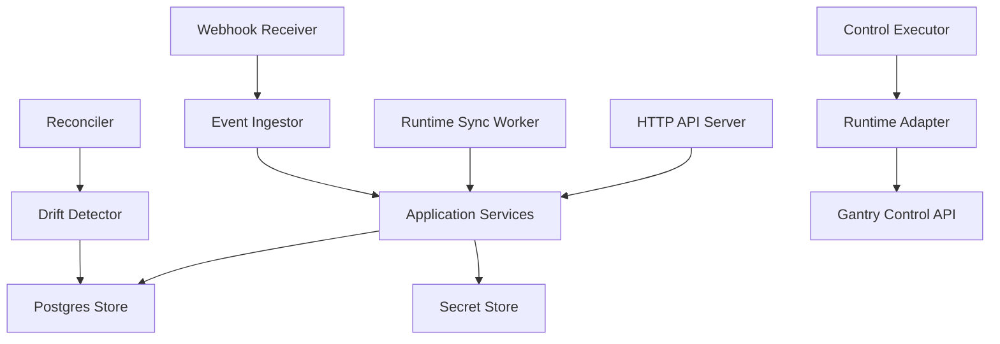
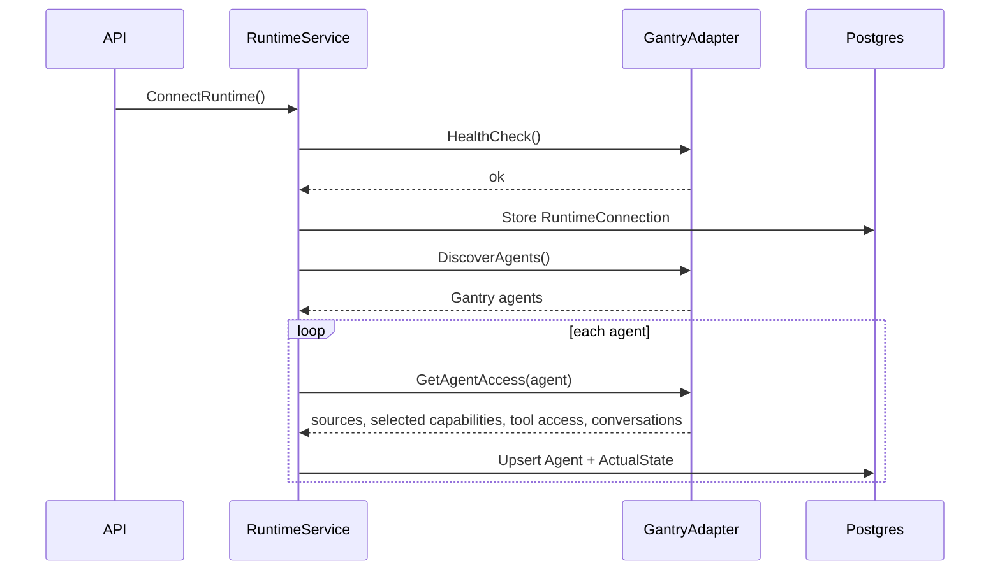
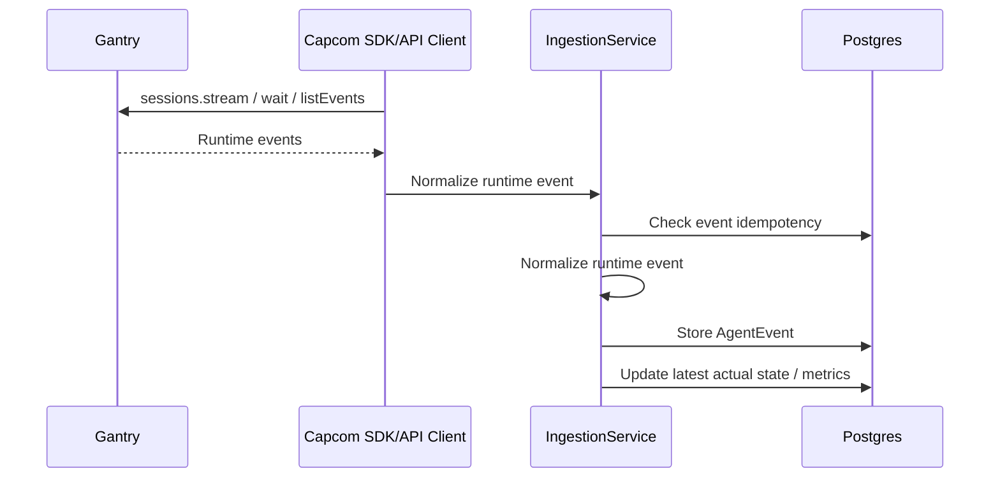
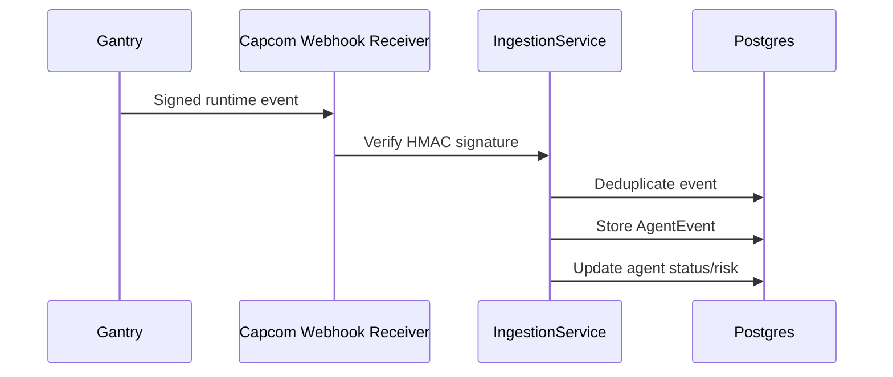
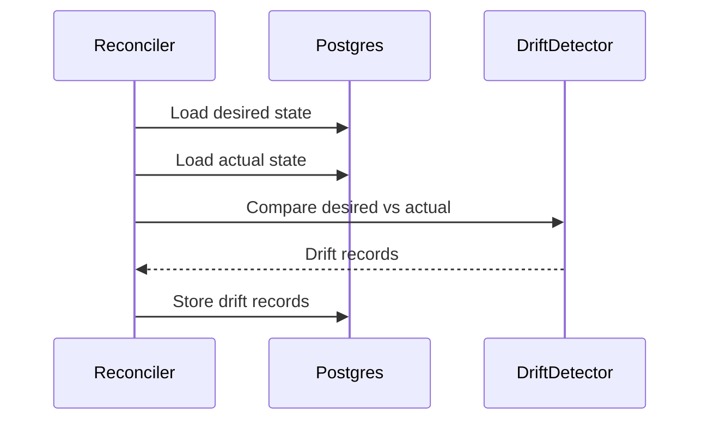
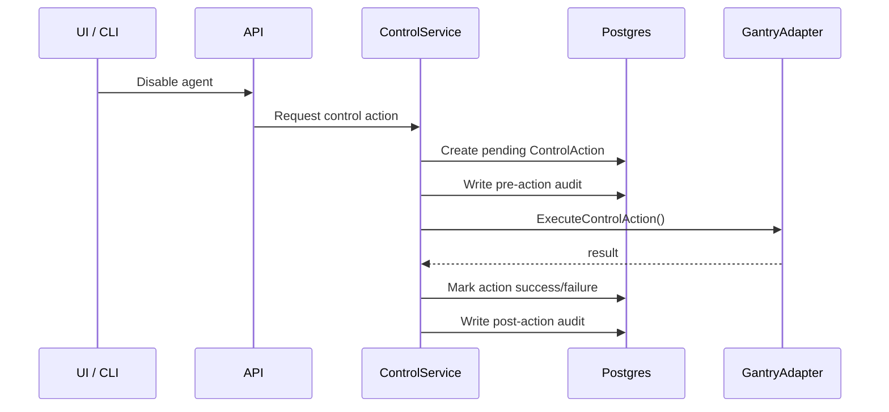

# Capcom Go Server Low-Level Design

## 1. Goal

The Capcom Go server is the core control-plane process for managing production AI agents across runtimes. In the MVP, it integrates with **Gantry** first.

The server should behave like an infrastructure control plane:

- store desired state
- observe actual runtime state
- detect drift
- execute safe control actions
- maintain audit history
- expose API/CLI/dashboard surfaces

It should not run agents itself. Gantry and future runtimes continue to run agents.

## 2. High-Level Process Model



## 3. Repository Layout

```text
cmd/
  capcom-server/
    main.go
  agentctl/
    main.go

internal/
  api/
  auth/
  config/
  domain/
  store/
  adapters/
    runtime/
    gantry/
  services/
  reconciler/
  ingestor/
  controls/
  audit/
  secrets/
  telemetry/
  workers/
```

## 4. Package Responsibilities

| Package | Responsibility |
|---|---|
| `cmd/capcom-server` | Starts API server, workers, config, database, telemetry |
| `cmd/agentctl` | CLI for apply/get/describe/diff/control actions |
| `internal/api` | REST handlers, request validation, response mapping |
| `internal/auth` | User auth, API keys, RBAC |
| `internal/config` | Environment/config loading |
| `internal/domain` | Pure domain models and business rules |
| `internal/store` | Postgres repositories and transactions |
| `internal/adapters/runtime` | Runtime adapter interface |
| `internal/adapters/gantry` | Gantry Control API implementation |
| `internal/services` | Application orchestration services |
| `internal/reconciler` | Desired-vs-actual comparison and drift records |
| `internal/ingestor` | Runtime event normalization and idempotency |
| `internal/controls` | Control action execution and safety checks |
| `internal/audit` | Audit log writer |
| `internal/secrets` | Secret references and encryption boundary |
| `internal/workers` | Periodic sync, reconciliation, webhook processing |

## 5. Core Domain Types

```go
type Agent struct {
    ID                AgentID
    RuntimeID         RuntimeID
    ExternalAgentID   string
    Name              string
    BusinessOwner     string
    TechnicalOwner    string
    EscalationContact string
    Purpose           string
    Environment       string
    RiskLevel         RiskLevel
    LifecycleState    LifecycleState
    RuntimeVersion    string
    CreatedAt         time.Time
    UpdatedAt         time.Time
}
```

```go
type RuntimeConnection struct {
    ID         RuntimeID
    Name       string
    Type       RuntimeType // gantry, paperclip, langgraph, etc.
    Endpoint   string
    AuthRef    SecretRef
    Mode       RuntimeMode // read_only or control_enabled
    Status     RuntimeStatus
    LastSyncAt *time.Time
}
```

```go
type AgentDesiredState struct {
    AgentID        AgentID
    ManifestID     string
    ManifestVersion string
    DesiredStatus  LifecycleState
    Capabilities   DesiredCapabilities
    Approvals      ApprovalPolicy
    Policies       AgentPolicies
}
```

```go
type DriftRecord struct {
    ID        DriftID
    AgentID   AgentID
    Field     string
    Desired   json.RawMessage
    Actual    json.RawMessage
    Mode      DriftMode // observe, approval, enforce
    Severity  Severity
    Status    DriftStatus
    CreatedAt time.Time
}
```

## 6. Runtime Adapter Interface

```go
type RuntimeAdapter interface {
    HealthCheck(ctx context.Context) error
    DiscoverAgents(ctx context.Context) ([]RuntimeAgent, error)
    GetAgent(ctx context.Context, externalAgentID string) (RuntimeAgent, error)
    GetAgentAccess(ctx context.Context, externalAgentID string) (RuntimeAgentAccess, error)
    ListCapabilities(ctx context.Context) ([]RuntimeCapability, error)
    RegisterWebhook(ctx context.Context, callbackURL string) (WebhookRegistration, error)
    ListEvents(ctx context.Context, cursor EventCursor) ([]RuntimeEvent, EventCursor, error)
    ExecuteControlAction(ctx context.Context, action RuntimeControlAction) (RuntimeControlResult, error)
}
```

Gantry is the first implementation:

```text
internal/adapters/gantry/
  client.go
  adapter.go
  mapper.go
  webhooks.go
  controls.go
```

The adapter should call Gantry through HTTP JSON APIs only. It should not read Gantry’s database directly.

## 7. Application Services

| Service | Responsibility |
|---|---|
| `RuntimeService` | Create/test runtime connections, register webhooks, trigger sync |
| `AgentService` | Read registry, desired state, actual state, events, metrics |
| `ManifestService` | Validate/apply YAML/API desired state |
| `ReconcilerService` | Compare desired and actual state, produce drift records |
| `ControlService` | Validate and execute mutating control actions |
| `IngestionService` | Verify webhook signatures, deduplicate events, normalize payloads |
| `AuditService` | Record every mutation, sync result, and control action |

## 8. HTTP API

```text
POST   /v1/runtime-connections
GET    /v1/runtime-connections
GET    /v1/runtime-connections/{id}
POST   /v1/runtime-connections/{id}/test
POST   /v1/runtime-connections/{id}/sync

GET    /v1/agents
GET    /v1/agents/{id}
PUT    /v1/agents/{id}/desired-state
GET    /v1/agents/{id}/actual-state
GET    /v1/agents/{id}/events
GET    /v1/agents/{id}/drift
GET    /v1/agents/{id}/metrics
GET    /v1/agents/{id}/topology

POST   /v1/control-actions
GET    /v1/control-actions
GET    /v1/control-actions/{id}

POST   /v1/webhooks/gantry/{runtimeID}

GET    /v1/audit
```

## 9. Background Workers

For MVP, these run in the same binary as goroutines.

| Worker | Trigger | Responsibility |
|---|---|---|
| Runtime sync worker | Timer or manual sync | Pull Gantry agents, access documents, capability catalog, and events |
| Drift worker | After sync or manifest update | Compare desired vs actual state |
| Webhook ingestion worker | Gantry webhook arrival | Verify, dedupe, normalize, persist |
| Control action worker | Control action request | Execute runtime mutation and update audit |

Later, these can be split into separate deployments.

## 10. Data Flow: Runtime Import



## 11. Data Flow: Webhook Event Ingestion

Default MVP path should be **SDK/control API ingestion**, not webhook-only ingestion.

Gantry exposes a server-side SDK/control API intended for backend apps and sidecars. Capcom can connect to it by socket path or loopback/base URL, then use:

- health and doctor APIs
- agent admin APIs
- capability APIs
- sessions events APIs
- jobs/runs APIs
- `sessions.stream`, `sessions.wait`, or `listEvents`

Webhooks are still useful, but they should be optional:

- Use SDK/control API polling or streaming as the simplest default.
- Use signed webhooks when Capcom has a stable callback URL and wants push-based updates.
- Use webhook replay/dead-letter only for webhook mode.



Optional webhook mode:



## 12. Data Flow: Reconciliation



## 13. Data Flow: Control Action



## 14. Database Tables

| Table | Purpose |
|---|---|
| `runtime_connections` | Connected runtimes and status |
| `agents` | Normalized agent registry |
| `agent_desired_states` | Approved desired state |
| `agent_actual_states` | Latest observed runtime state |
| `agent_metric_snapshots` | Lightweight operational metrics |
| `agent_business_values` | Manual value/KPI metadata |
| `agent_topologies` | Dependencies and handoff metadata |
| `agent_events` | Normalized runtime event timeline |
| `drift_records` | Desired-vs-actual mismatches |
| `control_actions` | Requested runtime mutations |
| `audit_logs` | Immutable mutation/change history |
| `secrets` | Encrypted secret refs or external secret references |
| `users` | MVP users and roles |

## 15. Similarity To Kubernetes Architecture

Capcom is architecturally similar to Kubernetes in its **control-plane pattern**, but it should not copy Kubernetes directly.

| Kubernetes | Capcom |
|---|---|
| API server stores desired state | Capcom API stores agent desired state |
| etcd stores cluster state | Postgres stores agent/runtime/control-plane state |
| Controllers reconcile desired vs actual state | Capcom reconciler detects agent drift |
| Kubelets report node/pod state | Runtime adapters report Gantry/agent state |
| CRDs extend Kubernetes resources | Capcom manifests define Agent and RuntimeConnection resources |
| kubectl applies YAML | agentctl applies YAML |
| Events describe cluster activity | AgentEvents describe runtime activity |
| RBAC controls cluster actions | Capcom RBAC controls agent operations |

Key difference:

> Kubernetes manages compute workloads. Capcom manages autonomous agent governance.

Kubernetes can restart pods and scale deployments. Capcom answers agent-specific questions:

- Who owns this agent?
- What tools and systems can it access?
- What approval policy applies?
- Is live runtime state different from approved state?
- What action did an operator take and why?
- Which agent is creating value or risk?

## 16. How Similar Are We To Kubernetes?

Estimated similarity: **60-70% at the architecture-pattern level**, but **20-30% at the resource/problem-domain level**.

Similar:

- API-centered control plane
- desired state
- actual state
- reconciliation loop
- declarative manifests
- CLI apply/get/describe/diff
- controllers/workers
- RBAC/audit

Different:

- Agents are not pods
- agent behavior is probabilistic
- approval and policy are first-class
- tool/data access matters more than CPU/memory
- business ownership and ROI matter
- many agents will run outside Kubernetes

So the right analogy is:

> Capcom borrows Kubernetes’ operating model, but applies it to agent governance instead of infrastructure scheduling.
