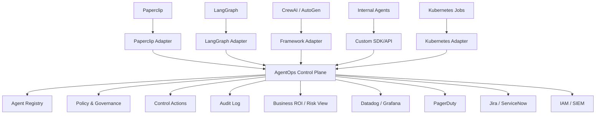

# Decision Matrix: Build on Paperclip vs Build Separate AgentOps Control Plane

## Recommendation

Build the AgentOps Control Plane as a separate product, and add Paperclip as an early integration/adapter.

This gives us the strongest strategic position: Paperclip validates the category, but our product should sit above Paperclip and other agent runtimes as the enterprise control layer.

## Decision Matrix

| Criteria | Build on Top of Paperclip | Build Separate Product + Paperclip Adapter | Why It Matters |
|---|---|---|---|
| Strategic differentiation | Weak. We may look like a Paperclip extension or fork. | Strong. We own the enterprise control plane category. | Customers and leadership need to understand why this is a separate company/product. |
| Long-term defensibility | Risky. Paperclip can add similar features directly. | Better. We support multiple runtimes and enterprise systems. | If we depend on Paperclip, our roadmap can be copied or blocked by their roadmap. |
| Enterprise positioning | Limited by Paperclip's "AI company / AI employee" metaphor. | Stronger enterprise AgentOps positioning. | Our buyer is likely Platform Engineering, AI Engineering, DevOps, Security, or Compliance. |
| Runtime coverage | Mostly centered around Paperclip-managed agents. | Cross-runtime: Paperclip, LangGraph, CrewAI, AutoGen, OpenAI Agents, internal agents, Kubernetes jobs, SaaS agents. | Enterprises will not standardize on one agent framework. |
| DevOps integration | Possible, but secondary to Paperclip's own workflow model. | Core product focus: Datadog, Grafana, PagerDuty, Jira, ServiceNow, Kubernetes, IAM, SIEM. | Our edge is connecting agents to existing enterprise operations. |
| Governance depth | Paperclip has approvals, budgets, audit, and task governance. | We can focus on production governance: tool access, data scopes, policy, approvals, compliance, lifecycle, risk. | Agent governance is broader than task approval. |
| Speed to demo | Fast. We can fork or extend Paperclip quickly. | Medium. We need our own minimal control plane, but can use Paperclip adapter for demo data. | Paperclip is useful for demos, but should not define the product boundary. |
| Product control | Lower. We inherit Paperclip's architecture, UX, data model, and roadmap assumptions. | Higher. We define our own product model and integrations. | The control plane needs a stable enterprise-first architecture. |
| Customer perception | "Why not just use Paperclip?" | "This governs Paperclip and everything else." | The second answer is stronger in a CEO/investor/customer conversation. |
| Exit options | Narrower: fork, plugin, or services around Paperclip. | Broader: independent SaaS, enterprise self-hosted, adapters marketplace, governance platform. | A separate product gives us a bigger strategic surface. |

## Why We Should Build Separately

Paperclip is focused on orchestrating AI agents as employees inside an AI-run company. That is useful and validates the market, but our opportunity is different.

Our product should be the enterprise control plane for production agents across the organization. It should govern agents no matter where they run: Paperclip, LangGraph, CrewAI, AutoGen, OpenAI Agents SDK, Kubernetes jobs, internal frameworks, or SaaS platforms.

If we build directly on Paperclip, we inherit their metaphor, architecture, and product direction. The market may see us as a Paperclip plugin rather than a standalone enterprise platform. More importantly, Paperclip could add similar features, making our differentiation harder to defend.

If we build separately, Paperclip becomes one managed source of agents. This is a stronger position because we can say:

> Paperclip helps teams run AI-agent companies. Our AgentOps Control Plane helps enterprises govern and operate all production agents across their existing DevOps, security, and compliance systems.

## Proposed Architecture

## Recommended MVP Direction

Build a lightweight standalone control plane with:

- Agent registry
- Agent SDK/API
- Paperclip adapter
- Live operational status
- Policy and approval workflow
- Control actions: pause, resume, rollback, restrict tool access
- Audit log
- Links or exports to Datadog, Grafana, Jira, ServiceNow, PagerDuty, and Kubernetes

## Summary

We should not build our core product on Paperclip. Paperclip is a strong open-source agent orchestration layer, and we should integrate with it. Our product should sit above Paperclip and similar runtimes as the enterprise AgentOps control plane. That gives us broader market coverage, stronger differentiation, and avoids becoming just a Paperclip plugin.

