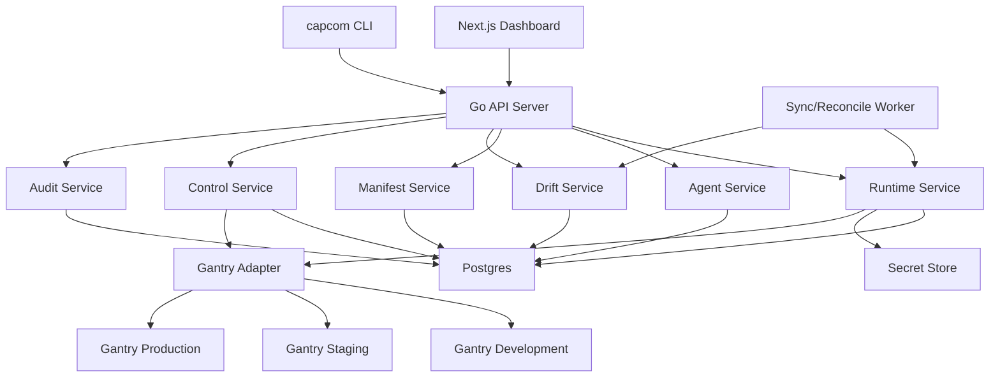
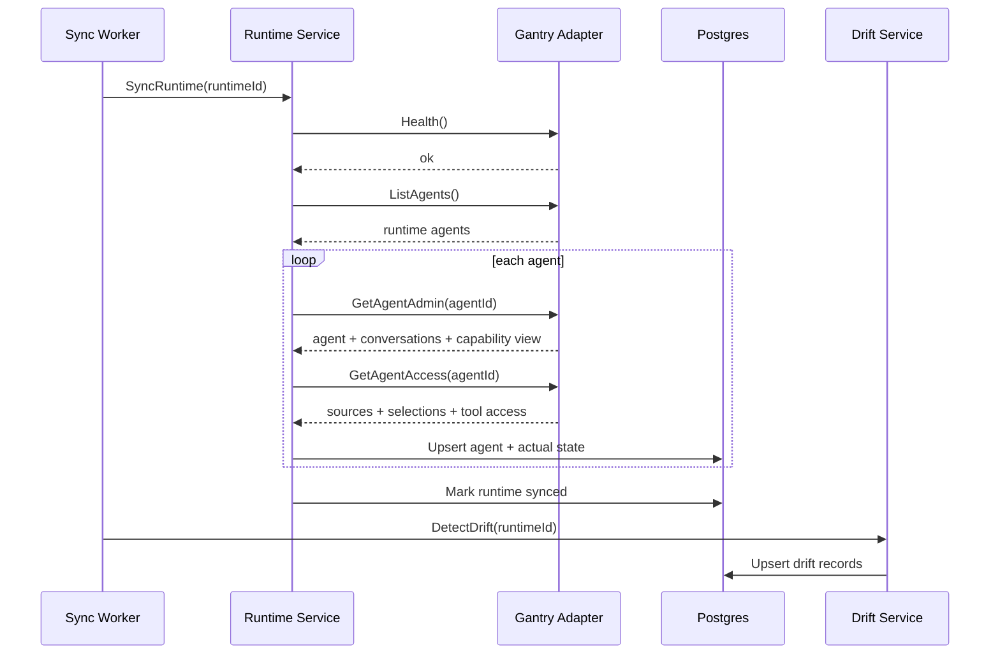
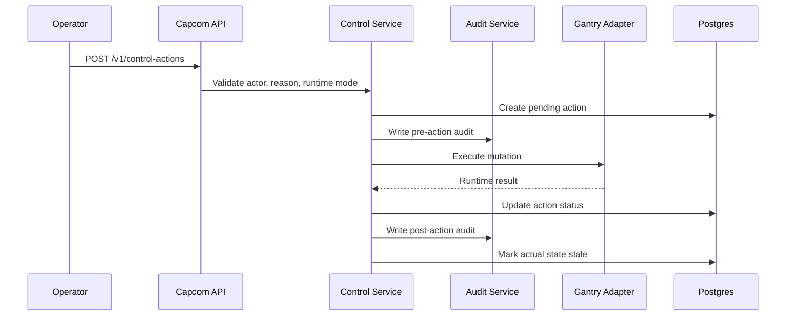

# 01 - Architecture Overview

## Goal

Capcom V1 is a standalone control plane for governing production agents, starting with Gantry. It owns approved desired state, imports actual runtime state, detects drift, executes safe control actions through runtime APIs, and records audit history.

## Non-Goals

- Do not run agents.
- Do not fork Gantry.
- Do not read Gantry database tables directly.
- Do not replace LangSmith, Langfuse, Phoenix, Datadog, or other observability tools.
- Do not implement autonomous remediation in V1.
- Do not require Kubernetes in V1.
- Do not require webhooks in V1.

## Component Diagram



One stateless adapter implementation serves many runtime instances. Every
adapter call receives a `RuntimeConnection`; the connection selects the
endpoint and secret reference. Agent, skill, run, and execution identities are
always scoped by `runtime_connection_id`, so identical Gantry-native IDs across
instances cannot collide.

## Main Runtime Loop



## Control Action Loop



## Service Responsibilities

| Service | Responsibility |
|---|---|
| Runtime Service | Runtime connections, health checks, sync orchestration |
| Agent Service | Normalized agent registry, actual state, timelines |
| Manifest Service | Validate and apply YAML/API desired state |
| Drift Service | Compare desired and actual state, manage drift records |
| Control Service | Validate and execute safe runtime mutations |
| Audit Service | Immutable mutation and sync audit history |
| Secret Service | Store or reference runtime credentials |
| Gantry Adapter | Translate Capcom calls into Gantry Control API calls |

## Package Layout

```text
cmd/
  capcom-server/
  capcom/

internal/
  api/
  auth/
  config/
  domain/
  store/
  services/
  adapters/
    runtime/
    gantry/
  drift/
  controls/
  audit/
  secrets/
  workers/
  manifests/
```

## Boundary Rule

Gantry-specific request/response structs must stay under `internal/adapters/gantry`. Domain services should operate on Capcom domain types only. Raw Gantry payloads may be stored for debugging, but they should not become the domain model.
